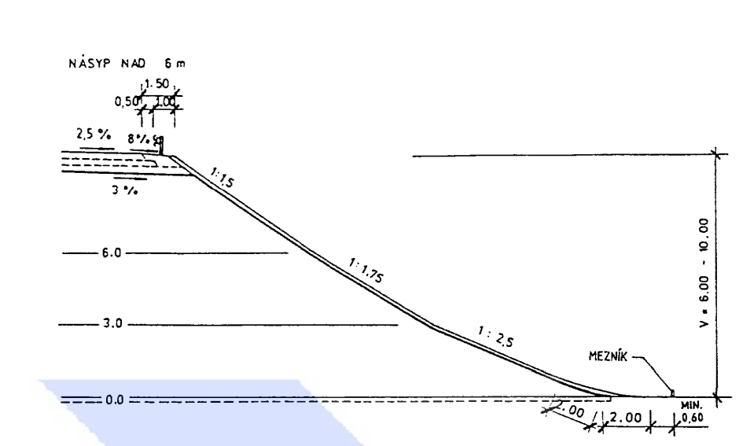

# Fill CSN 73 6101

Customize this subassembly according to your needs or just use it as an input parameter source.

See the page 27 of [ŘSD document](https://pjpk.rsd.cz/data/USR_001_2_10_VL/VL2_Silnicni_teleso__199505_.pdf)

## Usage

This is the basic algo for calculating Czech fill according to CSN 73 6101.
There is only one real point - no geometry is drawn in the model.
Only calculations are done during corridor rebuild.
An output parameter will inform you what kind of fill is calculated.

### Type of fill calculated

| Height | Fill type - output parameter | Description                                       |
| ------ | ---------------------------- | ------------------------------------------------- |
| <3     | 11                           | no brake on a fill                                |
| 3-6    | 12                           | one break on a fill - two slopes 1:2.5 and 1:1.5  |
| 6-9    | 13                           | two breaks on a fill - 1:2.5 and 1:1.75 and 1:1.5 |

#### <3

- |xxxxxxxxx 1:2.5
- |xxxxxxxxxxxxxx
- |xxxxxxxxxxxxxxxxxx
- |xxxxxxxxxxxxxxxxxxxxxx

#### 3-6

- |x 1:1.5
- |xx
- |xxx
- |xxxxxxx 1:2.5
- |xxxxxxxxxxxx
- |xxxxxxxxxxxxxxxxx

#### 6-9

- |x 1:1.5
- |xx
- |xxx
- |----- 1:1.75
- |-------
- |---------
- |xxxxxxxxxxxxxx 1:2.5
- |xxxxxxxxxxxxxxxxxx
- |xxxxxxxxxxxxxxxxxxxxxx

## How to add real geometry

Open graph in subassembly composer and look for "Decision" flowchart. At the bottom there is a "Layout" flowchart active only if SA is layout. Switch to layout in SAC.

Basic geometry is shown without no calculation points. These points exist in both Layout and Roadway mode. You can use them to connect your real geometry.

### Points

AP1 TOP Origin
AP23 second break
AP22 first break
AP21 Bottom of a fill

### Lines

AL12 - connects AP1 + AP23
AL11
AL10 - connect AP22 + AP 21

## Parameters

| Name          | Type    | Description                                                                                               |
| ------------- | ------- | --------------------------------------------------------------------------------------------------------- |
| Height 1      | 3       | calculation for the first fill break                                                                      |
| Height 2      | 3       | calculation for the second break at 6 m                                                                   |
| Grade 1       | 1:2.5   |                                                                                                           |
| Grade 2       | 1:1.75  |                                                                                                           |
| Grade 3       | 1:1.5   |                                                                                                           |
| OUT slope     | DOUBLE  | top line slope - AL12.Slope for fill type 13, AL11.Slope for fill type 12 and AL10.Slope for fill type 11 |
| OUT Fill type | INTEGER | 11 or 12 or 13 - no break or one break or two breaks on a fill                                            |

## Codes

### Points

### Lines

### Shapes

## Versions

| Version    | Date       | Description   |
| ---------- | ---------- | ------------- |
| 2020 1.0.0 | 2024-11-15 | First release |
|            |            |               |
